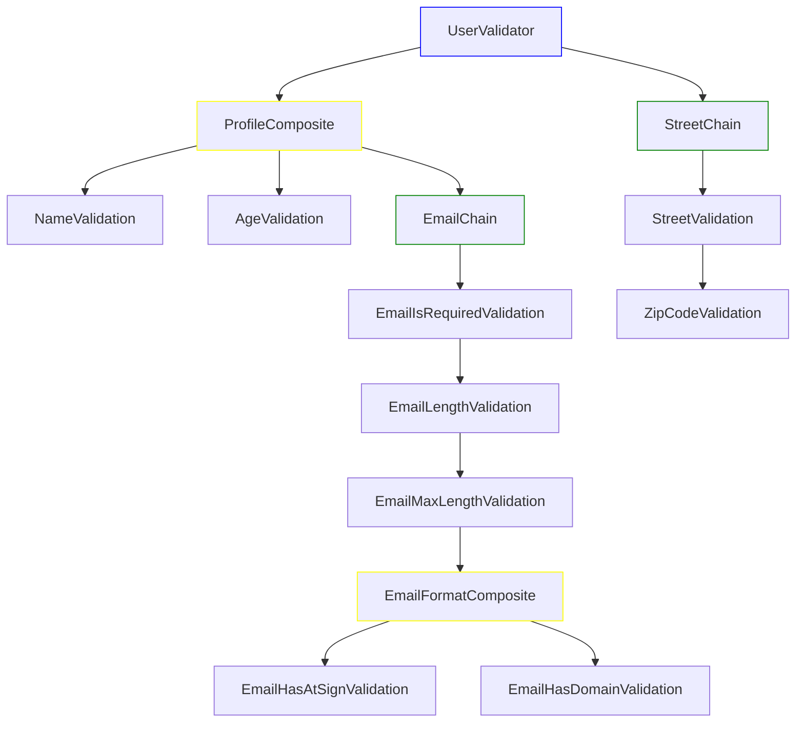
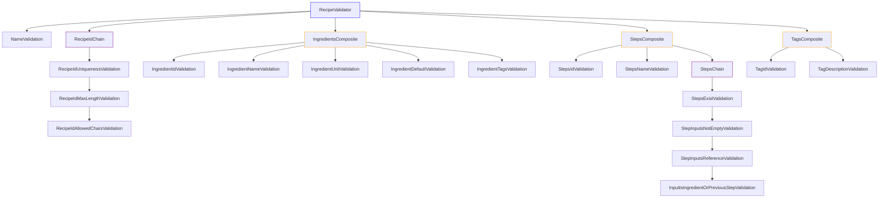

# Validator framework

## Context

On complex systems, besides JSON schema validation, we want to validate the actual JSON data to make sure it follows our business rules.

Data validation can become tricky on large scale - e.g. objects with 10s of properties, each with 10s of nested properties and so on.

## Problem

A central place to validate the data is great, however, on scale, the sheer amount of conditionals necessary to check everything can become a problem for readability, and soon enough we lose the ability to understand which business rules we follow and how we follow it.

Controlling validation dependency is also troublesome. Moving conditionals can have side-effects which are not expected.

```ts
function validateUser(payload: { name: string; age: number }): string[] {
  const errors: string[] = [];

  if (!payload.name) {
    errors.push("Name is required.");
  } else if (payload.name.length < 3) {
    errors.push("Name must be at least 3 characters long.");
  }

  if (!payload.age) {
    errors.push("Age is required.");
  } else if (typeof payload.age !== "number" || payload.age <= 0) {
    errors.push("Age must be a positive number.");
  } else if (payload.age < 18) {
    errors.push("Age must be at least 18.");
  }

  return errors;
}
```

A small example like the one above is rather easy - and preferably - should be done as shown.

But what about objects represent a recipe, like this:

```json
{
  "name": "Chocolate Cake",
  "recipeId": "recipe_001_chocolate_cake",
  "ingredients": [
    {
      "id": "flour",
      "name": "Flour",
      "unit": "cups",
      "default": 2,
      "tags": ["gluten"]
    },
    {
      "id": "sugar",
      "name": "Sugar",
      "unit": "cups",
      "default": 1,
      "tags": ["sweetener"]
    },
    {
      "id": "eggs",
      "name": "Eggs",
      "unit": "pieces",
      "default": 3,
      "tags": ["protein", "animalProduct"]
    }
  ],
  "steps": [
    {
      "id": "mix_dry",
      "description": "Mix flour and sugar together.",
      "inputs": ["flour", "sugar"]
    },
    {
      "id": "add_eggs",
      "description": "Add eggs to the dry mixture.",
      "inputs": ["mix_dry", "eggs"]
    },
    {
      "id": "bake",
      "description": "Bake the batter at 350°F for 30 minutes.",
      "inputs": ["add_eggs"]
    }
  ],
  "tags": [
    {
      "id": "gluten",
      "description": "Contains gluten."
    },
    {
      "id": "sweetener",
      "description": "Provides sweetness to the recipe."
    },
    {
      "id": "protein",
      "description": "Source of protein."
    },
    {
      "id": "animalProduct",
      "description": "Derived from animals."
    }
  ]
}
```

Besides checking simple properties such recipeId, things start to become tricky: does all the tags exists? Is the steps inputs only using either raw ingredients and/or outputs (id) from previous steps? and so on...

## Solution

To enable highly customizable validations, where flow is easily defined, and business logic is clear to the developer, I used two design patterns:

1. Chain of Responsibility - Give us the ability to create sequences of validations, where one failure prevents further validations to execute.

2. Composite - Enable grouping of validations, where all validations will be executed, even if one fails.

On the complex scenario above, we might want to create such validation schema:



The implementation can easily become a bunch of ifs/elses that obfuscate the business logic and became unmaintainable in no time.

With the design patterns I created two main classes to be extended and two interfaces:

```ts
export interface ValidationResult {
  valid: boolean;
  messages: string[];
}

export interface Validator {
  validate(payload: any): Promise<ValidationResult> | ValidationResult;
}

export abstract class ChainableValidator implements Validator {
  private nextValidator: Validator | null = null;

  setNext(validator: ChainableValidator): ChainableValidator {
    this.nextValidator = validator;
    return validator;
  }

  async validate(payload: any): Promise<ValidationResult> {
    const result = await this.validateInternal(payload);
    // Stop condition
    if (!result.valid) {
      return result;
    }
    return this.nextValidator ? this.nextValidator.validate(payload) : result;
  }

  endChain(composite: CompositeValidator): void {
    this.nextValidator = composite;
  }

  protected abstract validateInternal(
    payload: any
  ): Promise<ValidationResult> | ValidationResult;
}

export class CompositeValidator implements Validator {
  private validators: Validator[] = [];

  add(validator: Validator | Validator[]): this {
    this.validators.push(...[validator].flat());
    return this;
  }

  async validate(payload: any): Promise<ValidationResult> {
    const results = await Promise.all(
      this.validators.map((validator) => validator.validate(payload))
    );
    const valid = results.every((result) => result.valid);
    const messages = results.flatMap((result) => result.messages);
    return { valid, messages };
  }
}
```

By extending those classes we can create a group of validations and a sequence of validations, each highly specialized with the tradeoff of having multiple files (and I'll talk about this in a bit).

To achieve the same result, we could:

1. Create a Composite Validator (RecipeValidator)
1. Create a Chainable Validator (NameValidation)
1. Create a RecipeId Chain (RecipeIdChain) with the sequenced Chainable Validators (RecipeIdUniquenessValidation, RecipeIdMaxLengthValidation and RecipeIdAllowedCharsValidation)

```ts
class RecipeValidator extends CompositeValidator {
  constructor() {
    this.add(new NameValidation());
    this.add(new RecipeIdChain());
  }
}

class NameValidation extends ChainableValidator {
  protected validateInternal(payload: any): ValidationResult {
    if (payload.name === undefined) {
      return {
        valid: false,
        messages: ["Recipe name must be defined"],
      };
    }

    return {
      valid: true,
      messages: [],
    };
  }
}

class RecipeChain extends ChainableValidator {
  constructor() {
    super();
    this.setNext(new RecipeIdUniquenessValidation())
      .setNext(new RecipeIdAllowedCharsValidation())
      .setNext(new RecipeIdMaxLengthValidation());
  }
}
```

Even better, we could use more detailed names for each individual validation, make the business rules more explicit:

```ts
class RecipeValidator extends CompositeValidator {
  constructor() {
    this.add(new RecipeNameMustBeDefined());
    this.add(new RecipeIdChain());
  }
}

class RecipeNameMustBeDefined extends ChainableValidator {
  protected validateInternal(payload: any): ValidationResult {
    if (payload.name === undefined) {
      return {
        valid: false,
        messages: ["Recipe name must be defined"],
      };
    }

    return {
      valid: true,
      messages: [],
    };
  }
}

class RecipeChain extends ChainableValidator {
  constructor() {
    super();
    this.setNext(new RecipeIdMustBeUnique())
      .setNext(new RecipeIdMustHaveAlphanumericChars())
      .setNext(new RecipeIdMustHaveAtMost50Chars());
  }
}
```
