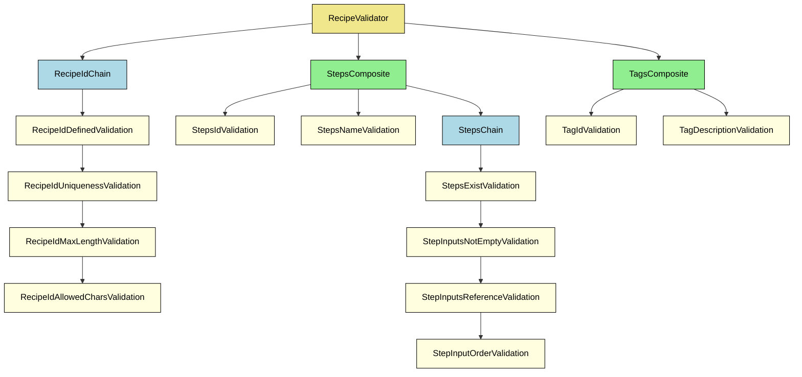

# Validator framework

## Context

On complex systems, besides JSON schema validation, we want to validate the actual JSON data to make sure it follows our business rules.

Data validation can become tricky on large scale - e.g. objects with 10s of properties, each with 10s of nested properties and so on.

## Problem

Suppose we are developing a recipe modeler, and our JSON data looks like this:

```json
[
  {
    "name": "Chocolate Cake",
    "recipeId": "recipe_001_chocolate_cake",
    "ingredients": [
      {
        "id": "flour",
        "name": "Flour",
        "unit": "cups",
        "default": 2,
        "tags": ["gluten"]
      },
      {
        "id": "sugar",
        "name": "Sugar",
        "unit": "cups",
        "default": 1,
        "tags": ["sweetener"]
      },
      {
        "id": "eggs",
        "name": "Eggs",
        "unit": "pieces",
        "default": 3,
        "tags": ["protein", "animalProduct"]
      }
    ],
    "steps": [
      {
        "id": "mix_dry",
        "description": "Mix flour and sugar together.",
        "inputs": ["flour", "sugar"]
      },
      {
        "id": "add_eggs",
        "description": "Add eggs to the dry mixture.",
        "inputs": ["mix_dry", "eggs"]
      },
      {
        "id": "bake",
        "description": "Bake the batter at 350°F for 30 minutes.",
        "inputs": ["add_eggs"]
      }
    ],
    "tags": [
      {
        "id": "gluten",
        "description": "Contains gluten."
      },
      {
        "id": "sweetener",
        "description": "Provides sweetness to the recipe."
      },
      {
        "id": "protein",
        "description": "Source of protein."
      },
      {
        "id": "animalProduct",
        "description": "Derived from animals."
      }
    ]
  }
]
```

Our business logic requires to validate the recipe id, ingredients, steps order, tags and so on.

Each item may have more that one rule associated with it, for example, the recipe id must not be a empty string or undefined, it needs to be unique, it have a max length and it should have only alphanumeric characters.

Initially, we could have a central place to validate each recipe, which makes everything accessible on one file:

```ts
function recipeValidator(recipe: Recipe) {
  return [...validateRecipe(recipe), ...validateTags(recipe)];
}

function validateRecipe(recipe: Recipe) {
  const id = recipe.id;
  const messages = [];

  if (!id) {
    messages.push("Invalid Recipe ID: ID must be defined");
  } else if (!isUnique(id)) {
    messages.push("Invalid Recipe ID: ID must be unique");
  } else if (id.length > 50) {
    messages.push("Invalid Recipe ID: ID length must be less than 50");
  } else if (!allAlphanumeric(id)) {
    messages.push(
      "Invalid Recipe ID: ID must have only alphanumeric characters"
    );
  }

  return messages;
}

function validateTags(recipe: Recipe) {
  const tags = recipe.tags;
  const messages = [];

  for (const tag of tags) {
    if (!isTagIdValid(tag)) {
      messages.push(`Invalid tag ID: ${tag.id}`);
    }
    if (!isTagDescriptionValid(tag)) {
      messages.push(`Invalid tag description: ${tag.id}`);
    }
  }
  return messages;
}
```

However, to check every property and it's rules starts to gobble up our validation. The sheer amount of conditionals necessary to check everything can become a problem for readability, and soon enough we lose the ability to understand which business rules we follow and the flow it should have - do we need to check the ID uniqueness if we don't even have an ID? Should we report the max length and alphanumeric together?

Controlling validation dependency (the flow mentioned earlier) is also troublesome. Moving conditionals can have side-effects which are not expected.

A small example like the one above is rather easy - and preferably - should be done as shown, but our recipe model is way more complex.

Besides checking the recipe id, things start to become tricky when we zoom-out: does all the tags exists? Is the steps inputs only using either raw ingredients and/or outputs (id) from previous steps? Does the steps are well defined? What about the ingredients? Does it have technical limitations as the recipe id?

With the odd feeling of a central place no longer being suitable, I did what the ancestral did: searched on Google, StackOverflow, Youtube... and ChatGPT for similar problems and it's solutions. Finally I created this proof of concept, which is now being used productively (with some adaptations and extensions).

## Solution

To enable highly customizable validations, where flow is easily defined, and business logic is clear to the developer, I used two design patterns:

1. Chain of Responsibility:

   - Represents a sequence of dependent validations, where one failure prevents further validations to execute.

2. Composite:
   - Is a group of validations, _composed_ of other Composites or Chains, where all validations will be executed - even if one fails, and report the aggregate result.

For our recipe validator, we might want to create the validations these validations:

- RecipeIdDefinedValidation
- RecipeIdUniquenessValidation
- RecipeIdMaxLengthValidation
- RecipeIdAllowedCharsValidation
- StepsIdValidation
- StepsNameValidation
- StepsExistValidation
- StepInputsNotEmptyValidation
- StepInputsReferenceExistValidation
- StepInputOrderValidation
- TagIdValidation
- TagDescriptionValidation

With dependency represented below:



The implementation of such scenario can easily become a bunch of ifs/elses that obfuscate the business logic and became unmaintainable in no time.

Using the design patterns, I created two main base classes and two interfaces:

```ts
export interface ValidationResult {
  valid: boolean;
  messages: string[];
}

export interface Validator {
  validate(payload: any): Promise<ValidationResult> | ValidationResult;
}

export abstract class ChainableValidator implements Validator {
  private nextValidator: Validator | null = null;

  setNext(validator: ChainableValidator): ChainableValidator {
    this.nextValidator = validator;
    return validator;
  }

  async validate(payload: any): Promise<ValidationResult> {
    const result = await this.validateInternal(payload);
    // Stop condition
    if (!result.valid) {
      return result;
    }
    return this.nextValidator ? this.nextValidator.validate(payload) : result;
  }

  endChain(composite: CompositeValidator): void {
    this.nextValidator = composite;
  }

  protected abstract validateInternal(
    payload: any
  ): Promise<ValidationResult> | ValidationResult;
}

export class CompositeValidator implements Validator {
  private validators: Validator[] = [];

  add(validator: Validator | Validator[]): this {
    this.validators.push(...[validator].flat());
    return this;
  }

  async validate(payload: any): Promise<ValidationResult> {
    const results = await Promise.all(
      this.validators.map((validator) => validator.validate(payload))
    );
    const valid = results.every((result) => result.valid);
    const messages = results.flatMap((result) => result.messages);
    return { valid, messages };
  }
}
```

By extending the base classes we can create a group of validations and a sequence of validations, each highly specialized and readable - with some tradeoffs elicited at the end of this article.

By refactoring our previous implementation:

1. Create a Composite Validator for the recipe (RecipeValidator)
1. Create a RecipeId Chain (RecipeIdChain) with the sequenced Chainable Validators (RecipeIdDefinedValidation, RecipeIdUniquenessValidation, RecipeIdMaxLengthValidation and RecipeIdAllowedCharsValidation)
1. Create a Tag Composite Validator (TagsComposite) and it's validations (TagIdValidation, TagDescriptionValidation).

```ts
class RecipeValidator extends CompositeValidator {
  constructor() {
    this.add(new RecipeIdChain());
    this.add(new TagsComposite());
  }
}

class RecipeChain extends ChainableValidator {
  constructor() {
    super();
    this.setNext(new RecipeIdDefinedValidation())
      .setNext(new RecipeIdUniquenessValidation())
      .setNext(new RecipeIdMaxLengthValidation())
      .setNext(new RecipeIdAllowedCharsValidation());
  }
}

class TagsComposite extends CompositeValidator {
  constructor() {
    this.add(new TagIdValidation());
    this.add(new TagDescriptionValidation());
  }
}

class RecipeIdDefinedValidation extends ValidationResult {
  validateInternal(payload: any): ValidationResult {
    if (!payload.id) {
      return {
        valid: false,
        message: ["Invalid Recipe ID: ID must be defined"],
      };
    }

    return {
      valid: true,
      message: [],
    };
  }
}

// other validations
```

Even better, we could use more detailed names for each individual validation, make the business rules more explicit:

```ts
class RecipeValidator extends CompositeValidator {
  constructor() {
    this.add(new RecipeIdChain());
    this.add(new TagsComposite());
  }
}

class RecipeChain extends ChainableValidator {
  constructor() {
    super();
    this.setNext(new RecipeIdMustBeDefined())
      .setNext(new RecipeIdMustBeUnique())
      .setNext(new RecipeIdMustHaveMaxLength())
      .setNext(new RecipeIdMustHaveAllowedOnlyAlphanumericChars());
  }
}

class TagsComposite extends CompositeValidator {
  constructor() {
    this.add(new TagIdValidation());
    this.add(new TagDescriptionValidation());
  }
}

class RecipeIdMustBeDefined extends ValidationResult {
  validateInternal(payload: any): ValidationResult {
    if (!payload.id) {
      return {
        valid: false,
        message: ["Invalid Recipe ID: ID must be defined"],
      };
    }

    return {
      valid: true,
      message: [],
    };
  }
}
```

## Tradeoffs

#### Files

From the get-go the amount of files - if we follow one class per file - is the first tradeoff. At the same time that having one huge file is not good, having one huge folder of smaller files aren't good either. However, when I want to maintain a validation, preferably I want to read and look only the code related to what I'm maintaining, thus smaller files seems to be the winning options here.

#### Dependencies

Some validations might need to fetch some data from somewhere else or need extra information from the system. We could solve add those dependencies on the constructor, however, if the need is only deep into the flow, we start to have prop drilling problems. I rather create external services, which are configured prior to the validation execution that can be consumed on-demand by the validations that requires the data that the service holds. The drawback here is the necessity to know which services do we need in order to fully validate the model.

## Benefits

Besides having clear business rules and readable validations, testing becomes very easy as we can instantiate a single validation and test it alone. Also, full blown integration tests against the root validator can safely report how the validations will report a given payload.

## Next steps

The proof-of-concept does not use Generics, but by adding it to the Validator (and the classes that implements it) we can define the payload type, make even more readable and helps with LSP.

I feel this solution can be more simplified, one attempt of that is the "function based" validations, but more time is needed to evolve this idea.

Finally, I was able to fully create the Mermaid diagram using Github Copilot, which indicates that a documentation flow can be created, making the business rules clear to other developers that do not actively develop the validations. The diagrams can be found on the Readmes of each test folder.

Gustavo Jesinski
