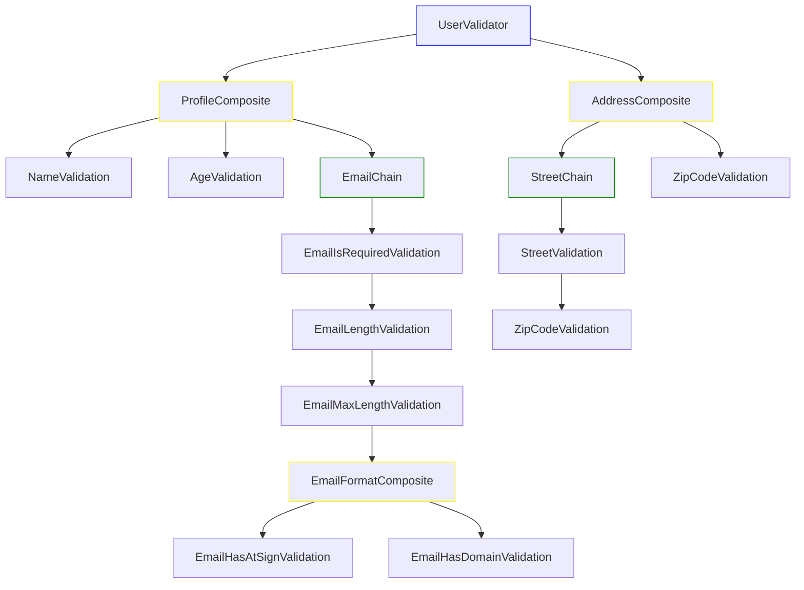

```mermaid
graph TD
%% Main Validator
UserValidator --> ProfileComposite
UserValidator --> AddressComposite

%% Profile Composite
ProfileComposite --> NameValidation
ProfileComposite --> AgeValidation
ProfileComposite --> EmailChain

%% Email Chain
EmailChain --> EmailIsRequiredValidation
EmailIsRequiredValidation --> EmailLengthValidation
EmailLengthValidation --> EmailMaxLengthValidation
EmailMaxLengthValidation --> EmailFormatComposite

%% Email Format Composite
EmailFormatComposite --> EmailHasAtSignValidation
EmailFormatComposite --> EmailHasDomainValidation

%% Address Composite
AddressComposite --> StreetChain
AddressComposite --> ZipCodeValidation[ZipCodeValidation]

%% Street Chain
StreetChain --> StreetValidation
StreetValidation --> ZipCodeValidation2[ZipCodeValidation]

classDef composite stroke:yellow
classDef chain stroke:green
classDef validator stroke:blue

class UserValidator validator
class ProfileComposite composite
class AddressComposite composite
class EmailChain chain
class EmailFormatComposite composite
class StreetChain chain
```
