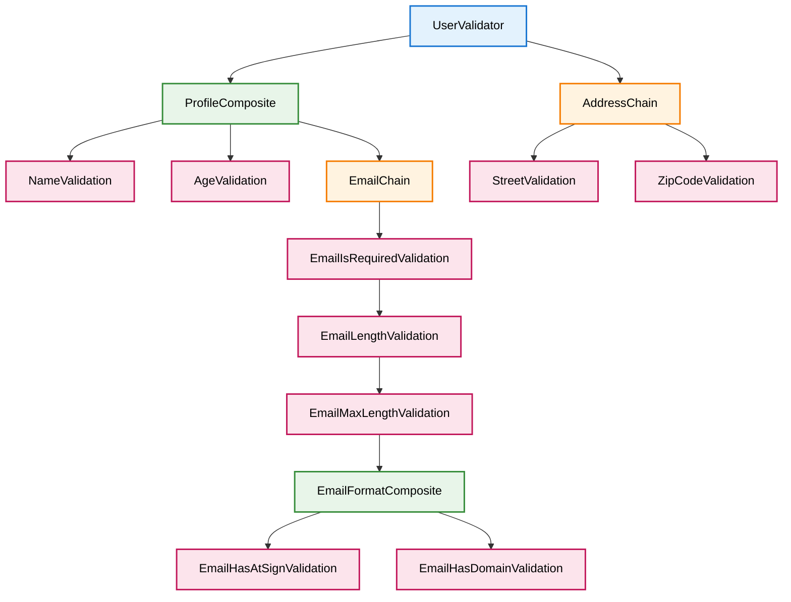

The following diagram was created with Github Copilot chat functionality, by adding the tests/e2e/class-based as context and with the prompt below:

> Create a Mermaid TD chart for the UserValidator. Create the sequences of validations of a chain and the group of validations of a composite. The Validators, Chains, Composites and Validations should have a specific color. The font color should be black.

